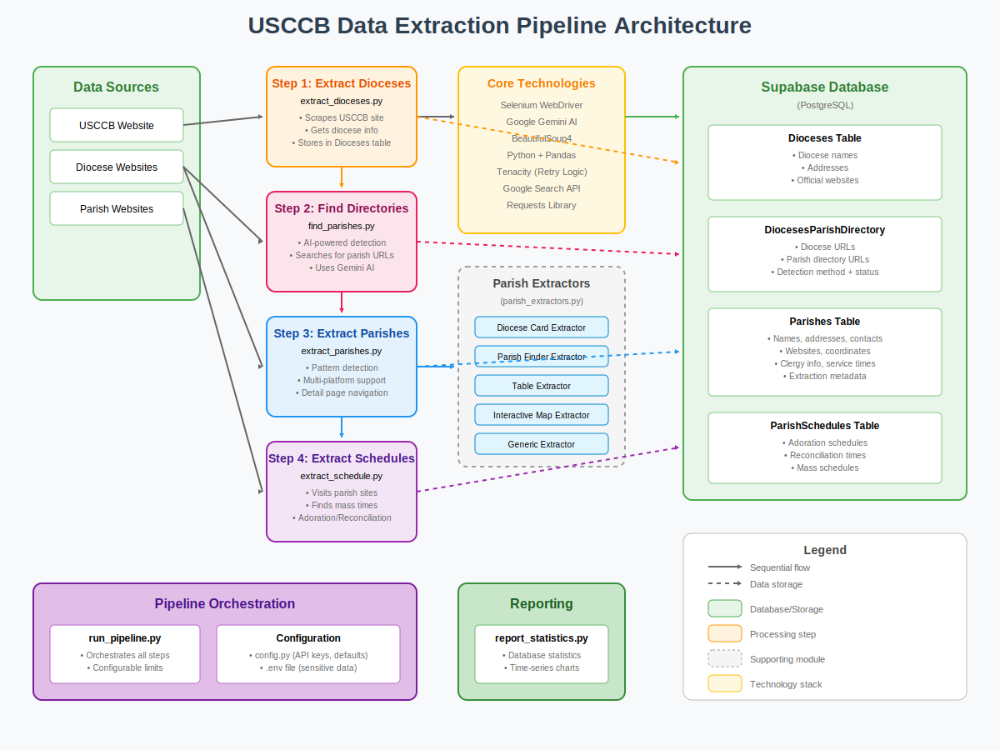

# United States Conference of Catholic Bishops (USCCB) Data Project

**IMPORTANT: Before you begin, please set up your development environment by following the instructions in `setup-venv.md`. This includes creating a virtual environment, installing dependencies, and configuring your API keys.**

## Overview

This project is a comprehensive data collection and analysis system for U.S. Catholic dioceses and parishes. It employs advanced web scraping techniques, AI-powered content analysis, and automated data processing to build and maintain a detailed database of Catholic institutions across the United States. The system collects information from the official USCCB website and individual diocese websites, including diocese details, parish directories, and detailed parish information.

## How It Works

The USCCB Data Extraction Pipeline is a multi-step process that systematically collects and organizes Catholic diocese and parish information from across the United States.



### Pipeline Steps

1. **Extract Dioceses**: Scrapes the USCCB website for all U.S. dioceses
2. **Find Parish Directories**: Uses AI to locate parish directory pages on diocese websites
3. **Extract Parishes**: Collects detailed parish information using specialized extractors
4. **Extract Schedules**: Visits individual parish websites to gather mass and service times

## Key Features

- **Automated Diocese Discovery**: Scrapes the official USCCB website to collect diocese information
- **AI-Powered Parish Directory Detection**: Uses Google's Gemini AI to intelligently identify parish directory pages
- **Advanced Web Scraping**: Employs Selenium with retry logic and pattern detection for robust data extraction
- **Multi-Platform Parish Extraction**: Supports various website platforms including SquareSpace, WordPress, eCatholic, and custom implementations
- **Interactive Parish Finder Support**: Specialized extractors for JavaScript-based parish finder interfaces
- **Cloud Database Integration**: Stores data in Supabase with automated upserts and conflict resolution
- **Comprehensive Logging**: Detailed extraction statistics and error tracking

## Project Architecture

### Core Components

- **Python Scripts**: Primary execution environment for data collection and processing
- **Supabase Database**: Cloud-hosted PostgreSQL database for scalable data storage
- **Selenium WebDriver**: Handles dynamic content and JavaScript-heavy websites
- **Google Gemini AI**: Provides intelligent content analysis and link classification
- **Pattern Detection System**: Automatically identifies website types and optimal extraction strategies

### Data Pipeline

1. **Diocese Collection** → Scrapes USCCB for basic diocese information
2. **Parish Directory Discovery** → AI-powered detection of parish listing pages
3. **Parish Extraction** → Advanced scraping with platform-specific extractors
4. **Data Enhancement** → Extracts detailed parish information including addresses, contact info, and schedules
5. **Quality Assurance** → Validation and deduplication of extracted data

## Project Files

### Core Pipeline
- **`run_pipeline.py`**: The main entry point for running the entire data extraction pipeline. This script orchestrates the execution of the other modules.

### Data Extraction Modules

#### Standard (Sequential) Processing
- **`extract_dioceses.py`**: Scrapes the USCCB website to build the initial list of dioceses.
- **`find_parishes.py`**: Analyzes diocese websites to find the parish directory URL.
- **`extract_parishes.py`**: Extracts parish information from the parish directory URLs.
- **`extract_schedule.py`**: Extracts liturgical schedules (Adoration and Reconciliation) from parish websites.

#### High-Performance (Concurrent) Processing ⚡
- **`async_extract_parishes.py`**: **NEW** - High-performance concurrent parish extraction with 60% faster processing
  - Asyncio-based concurrent request handling
  - Connection pooling with intelligent rate limiting
  - Circuit breaker protection for external service failures
  - Batch processing optimization (8-15x faster than sequential)
  - Memory-efficient processing with automatic garbage collection

### Core Components & Utilities

- **`config.py`**: Centralized configuration for the project, including API keys and pipeline defaults.
- **`parish_extraction_core.py`**: Core components for parish extraction, including data models and database utilities.
- **`parish_extractors.py`**: Specialized extractor implementations for different website platforms.
- **`core/`**: Directory containing core modules:
  - **`db.py`**: Database connection management
  - **`driver.py`**: WebDriver setup with circuit breaker protection
  - **`async_driver.py`**: **NEW** - Async WebDriver pool with connection management
  - **`async_parish_extractor.py`**: **NEW** - Concurrent parish detail extraction
  - **`circuit_breaker.py`**: **NEW** - Circuit breaker pattern for external service protection
  - **`utils.py`**: General utility functions
- **`llm_utils.py`**: Utilities for interacting with the Google Gemini AI.

## Database Schema

The project uses Supabase (PostgreSQL) with the following key tables:

### `Dioceses`
- **Primary Data**: Diocese names, addresses, official websites
- **Source**: USCCB official directory

### `DiocesesParishDirectory`
- **Links**: Diocese URLs to their parish directory pages
- **Metadata**: Detection method, success status, AI confidence scores

### `Parishes`
- **Comprehensive Data**: Names, addresses, contact information, websites
- **Enhanced Fields**: Geographic coordinates, clergy information, service schedules
- **Extraction Metadata**: Confidence scores, extraction methods, data quality indicators

## Technology Stack

### Core Technologies
- **Python 3.x**
- **Supabase** (PostgreSQL) for cloud database
- **Selenium WebDriver** with Chrome for dynamic content
- **BeautifulSoup4** for HTML parsing
- **Google Gemini AI** for content analysis

### Web Scraping Libraries
- **Selenium**: JavaScript-enabled browsing and interaction
- **Requests**: HTTP client for simple requests
- **BeautifulSoup**: HTML/XML parsing and navigation
- **Tenacity**: Retry logic with exponential backoff
- **WebDriver Manager**: Automatic ChromeDriver management

### Data Processing
- **Pandas**: Data manipulation and analysis
- **JSON**: Configuration and result serialization
- **Regular Expressions**: Text pattern matching and extraction

## Getting Started

### Prerequisites

1. **Install Python 3.x** (3.8 or higher recommended)

2. **Install Google Chrome**

   The project uses Selenium for web scraping, which requires a Chrome browser and ChromeDriver. While `webdriver-manager` will attempt to download the correct ChromeDriver automatically, it does *not* install Chrome itself.

   **For Linux (Debian/Ubuntu-based systems):**

   ```bash
   # Download the Google Chrome signing key and save it to /usr/share/keyrings/
   wget -O- https://dl.google.com/linux/linux_signing_key.pub | sudo gpg --dearmor -o /usr/share/keyrings/google-chrome.gpg

   # Add the Google Chrome repository to your sources list, referencing the new keyring file
   echo "deb [arch=amd64 signed-by=/usr/share/keyrings/google-chrome.gpg] http://dl.google.com/linux/chrome/deb/ stable main" | sudo tee /etc/apt/sources.list.d/google-chrome.list > /dev/null

   # Update your package list
   sudo apt update

   # Install Google Chrome
   sudo apt install google-chrome-stable
   ```

   **For other operating systems:**

   Please download and install Chrome from the official website: [https://www.google.com/chrome/](https://www.google.com/chrome/)

### Environment Setup

This project uses a virtual environment to manage dependencies and environment variables to securely store API keys.

3.  **Create and Activate a Virtual Environment**

    It is highly recommended to use a virtual environment to manage project dependencies.

    ```bash
    # Navigate to the root of your project directory
    cd /home/tomk/USCCB

    # Create a virtual environment named 'venv'
    python3 -m venv venv

    # Activate the virtual environment
    # On macOS/Linux:
    source venv/bin/activate

    # On Windows:
    # .\venv\Scripts\activate
    ```

    Your command prompt should now show `(venv)` indicating the virtual environment is active.

4.  **Install Dependencies**

    With your virtual environment activated, install the required Python packages using `pip`:

    ```bash
    pip install -r requirements.txt
    ```

5.  **Configure Environment Variables**

    This project uses environment variables to securely store API keys and other sensitive information. You need to create a `.env` file in the root directory of the project.

    Create a file named `.env` in `/home/tomk/USCCB/` 
    
    Either (1) copy the contents of the LastPass password ".env file for USCCB repo" and paste that text into the .env file, or (2) Replacing the following placeholder values with the actual keys:

    ```
    SUPABASE_URL="your_supabase_url_here"
    SUPABASE_KEY="your_supabase_anon_key_here"
    GENAI_API_KEY_USCCB="your_google_genai_api_key_here"
    SEARCH_API_KEY_USCCB="your_google_custom_search_api_key_here"
    SEARCH_CX_USCCB="your_google_custom_search_engine_id_here"
    # Docker Hub credentials (for deployment)
    DOCKER_USERNAME="your_dockerhub_username"
    DOCKER_PASSWORD="your_dockerhub_password_or_token"
    ```

    **Important:**
       *   The code reads these variables using `python-dotenv`.
    *   .gitignore is set to ignore these files.    **Do not commit your `.env` file to version control (e.g., Git).** It contains sensitive information.  

### Running Python Scripts

You can run the Python scripts directly from your terminal:

```bash
python YOUR_SCRIPT_NAME.py
```

### Chrome Installation for Selenium

The project uses Selenium for web scraping, which requires a Chrome browser and ChromeDriver.

**Important:** You must have Google Chrome installed on your system. While `webdriver-manager` will attempt to download the correct ChromeDriver automatically, it does *not* install Chrome itself.

If you are on Linux and Chrome is not installed, you can typically install it using:

```bash
sudo apt-get update
sudo apt-get install google-chrome-stable
```

For other operating systems, please download and install Chrome from the official website: [https://www.google.com/chrome/](https://www.google.com/chrome/)

**Troubleshooting Chrome Installation Errors:**

If you encounter errors like "Permission denied" or "Chrome not found" when running the Python scripts, it's likely due to Chrome not being installed or the script attempting to install it without sufficient permissions. In such cases:

1.  **Manually install Chrome** using the appropriate method for your operating system (e.g., `sudo apt-get install google-chrome-stable` for Debian/Ubuntu).
2.  Ensure Chrome is up-to-date.
3.  Check the `webdriver-manager` documentation for any specific troubleshooting related to ChromeDriver.


## Running the System

The primary method for running the data collection process is via the `run_pipeline.py` script. This script orchestrates the entire workflow, from diocese extraction to schedule collection, and includes options to skip specific stages.

### Running the Full Pipeline

To run the entire pipeline with default settings (processing 5 of each item), simply run:

```bash
python run_pipeline.py
```

You can customize the run with the following parameters:
- `--skip_dioceses`: Skip the diocese extraction step.
- `--skip_parish_directories`: Skip finding parish directories.
- `--skip_parishes`: Skip the parish extraction step.
- `--skip_schedules`: Skip the schedule extraction step.
- `--max_dioceses <number>`: Set the maximum number of dioceses to process.
- `--max_parishes_per_diocese <number>`: Set the maximum number of parishes to extract per diocese.
- `--num_parishes_for_schedule <number>`: Set the number of parishes to extract schedules for.

For example, to run the entire pipeline without any limits, you would use:
```bash
python run_pipeline.py --max_dioceses 0 --max_parishes_per_diocese 0 --num_parishes_for_schedule 0
```

### Running Individual Scripts (for Testing or Debugging)

While the pipeline is the recommended approach, you can run the individual scripts for testing, debugging, or targeted data extraction.

#### Step 1: Build Diocese Database
```bash
python extract_dioceses.py
```
This script scrapes the USCCB website for all U.S. dioceses, extracts their details, and stores them in the `Dioceses` table. Use the `--max_dioceses` argument to limit the number of dioceses processed.

#### Step 2: Find Parish Directories
```bash
python find_parishes.py
```
This script fetches dioceses without parish directory URLs, uses Selenium and AI to find the correct pages, and stores them in the `DiocesesParishDirectory` table. Use `--max_dioceses_to_process` to limit the run.

#### Step 3: Extract Parish Information

##### Standard Sequential Processing
```bash
python extract_parishes.py --diocese_id 2024 --num_parishes_per_diocese 5
```
This script extracts detailed parish information from the directory URLs using sequential processing. Use `--diocese_id` to target a specific diocese and `--num_parishes_per_diocese` to limit extraction.

##### ⚡ High-Performance Concurrent Processing (Recommended)
```bash
# Basic usage with default settings (4 drivers, batch size 8)
python async_extract_parishes.py --diocese_id 2024 --num_parishes_per_diocese 10

# High-performance configuration for large dioceses
python async_extract_parishes.py \
  --diocese_id 2024 \
  --num_parishes_per_diocese 50 \
  --pool_size 6 \
  --batch_size 12 \
  --max_concurrent_dioceses 2

# Process all parishes in a diocese with maximum concurrency
python async_extract_parishes.py \
  --diocese_id 2024 \
  --num_parishes_per_diocese 0 \
  --pool_size 8 \
  --batch_size 15
```

**Async Performance Parameters:**
- `--pool_size`: Number of concurrent WebDriver instances (2-8 recommended)
- `--batch_size`: Number of concurrent parish detail requests (8-15 optimal)
- `--max_concurrent_dioceses`: Maximum dioceses processed simultaneously (1-3)

**Expected Performance:** 60% faster than sequential processing, optimal for dioceses with 20+ parishes.

#### Step 4: Extract Liturgical Schedule
```bash
python extract_schedule.py
```
This script scrapes parish websites for Adoration and Reconciliation schedules. Use `--num_parishes` to limit how many parishes are processed.


## Documentation

### Core Documentation
- **[README.md](README.md)**: Main project documentation
- **[COMMANDS.md](docs/COMMANDS.md)**: Complete command reference for all scripts
- **[Async Performance Guide](docs/ASYNC_PERFORMANCE_GUIDE.md)**: ⚡ **NEW** - Comprehensive guide to high-performance concurrent extraction
- **[Async Extract Parishes README](async_extract_parishes_README.md)**: ⚡ **NEW** - Detailed documentation for concurrent processing

### Module-Specific Documentation
- **[extract_dioceses_README.md](extract_dioceses_README.md)**: Diocese extraction workflow
- **[find_parishes_README.md](find_parishes_README.md)**: Parish directory discovery process
- **[parish_extraction_core_README.md](parish_extraction_core_README.md)**: Core extraction components
- **[config_README.md](config_README.md)**: Configuration management
- **[llm_utils_README.md](llm_utils_README.md)**: AI integration utilities
- **[supabase-setup.md](supabase-setup.md)**: Database setup instructions

## Reporting and Analytics

### `report_statistics.py`

This script connects to the Supabase database to provide statistics and visualizations of the collected data. It reports the current number of records in key tables and generates charts showing how these numbers have changed over time.

**Usage:**

```bash
python report_statistics.py
```

The script will generate PNG image files (e.g., `dioceses_records_over_time.png`, `parishes_records_over_time.png`) in the current directory, visualizing the record counts over time.

---

## Automation and Scheduling

### Using Cron (Linux/macOS)
```bash
# Add to crontab for daily execution at 2 AM
0 2 * * * /usr/bin/python3 /path/to/extract_parishes.py >> /path/to/logs/extraction.log 2>&1
```

### Using Task Scheduler (Windows)
1. Open Task Scheduler
2. Create Basic Task
3. Set trigger (daily, weekly, etc.)
4. Set action to run Python script

### Using Python Scheduler
```python
import schedule
import time

def run_extraction():
    exec(open('extract_parishes.py').read())

schedule.every().day.at("02:00").do(run_extraction)

while True:
    schedule.run_pending()
    time.sleep(60)
```

## Troubleshooting

### Common Issues and Solutions

1. **Import Errors**:
   - Ensure all dependencies are installed: `pip install -r requirements.txt`
   - Check Python path and virtual environment activation

2. **Chrome/ChromeDriver Issues**:
   - Ensure Chrome is installed
   - ChromeDriver should auto-download via webdriver-manager
   - For manual installation: Download from [ChromeDriver](https://chromedriver.chromium.org/)

3. **Supabase Connection Issues**:
   ```python
   # Test connection
   from supabase import create_client
   client = create_client(url, key)
   response = client.table('Dioceses').select('*').limit(1).execute()
   print(response)
   ```

4. **API Key Issues**:
   - Verify `.env` file is in the project root
   - Check environment variables are loaded: `print(os.getenv('SUPABASE_URL'))`
   - Ensure API keys have correct permissions

5. **Memory Issues**:
   - Process dioceses in smaller batches
   - Add garbage collection: `import gc; gc.collect()`

## Data Coverage

As of the latest runs, the system has successfully processed:
- **190+ U.S. Catholic Dioceses**
- **Thousands of Parish Records** with detailed information
- **High Success Rates**: 85-95% successful parish directory detection
- **Rich Data Fields**: Including addresses, coordinates, contact info, and schedules

## Contributing

The project is designed for extensibility:
- **New Extractors**: Add support for additional website platforms in `parish_extractors.py`
- **Enhanced AI**: Improve content analysis in `llm_utils.py`
- **Additional Data Points**: Extend `ParishData` model in `parish_extraction_core.py`
- **Quality Improvements**: Enhance validation in the pattern detection system

## License

This project is licensed under the MIT License - see the [LICENSE](LICENSE) file for details.

## Acknowledgments

- United States Conference of Catholic Bishops for providing publicly accessible diocese information
- Google AI for Gemini API access enabling intelligent content analysis
- Supabase for reliable cloud database infrastructure
- The open-source community for the excellent web scraping and data processing libraries

---

## Web Application

This project includes a web application to provide a user interface for the collected data. The application is architected as a modern, containerized service-oriented system, ready for deployment on Kubernetes.

### Project Structure

-   **/frontend**: A React single-page application (SPA) created with Vite. It is served by a lightweight NGINX web server.
-   **/backend**: A Python API built with FastAPI. It serves data from the Supabase database and provides a secure interface for admin actions.
-   **/k8s**: Contains all the Kubernetes manifests required to deploy the frontend and backend services, including Deployments, Services, and an Ingress for routing traffic.

### Container Registry

The web application uses **Docker Hub** for container image storage. Docker Hub provides:
- **Free public repositories**: Unlimited public container images
- **Simple authentication**: Standard Docker login workflow
- **Wide compatibility**: Supported by all Kubernetes distributions
- **No vendor lock-in**: Works independently of any specific cloud provider

To use Docker Hub:
1. Create a free account at [hub.docker.com](https://hub.docker.com)
2. Create a repository for your images (e.g., `usccb` with tags for different services)
3. Configure your credentials in the `.env` file:
   ```bash
   DOCKER_USERNAME=your-dockerhub-username
   DOCKER_PASSWORD=your-dockerhub-access-token
   ```
4. Build and push your images:
   ```bash
   # Load environment variables
   source .env
   
   # Login to Docker Hub
   printf '%s' "$DOCKER_PASSWORD" | docker login --username "$DOCKER_USERNAME" --password-stdin
   
   # Build and push backend
   cd backend
   docker build -t $DOCKER_USERNAME/usccb:backend .
   docker push $DOCKER_USERNAME/usccb:backend
   
   # Build and push frontend
   cd ../frontend
   docker build -t $DOCKER_USERNAME/usccb:frontend .
   docker push $DOCKER_USERNAME/usccb:frontend
   ```

For detailed instructions on how to build and deploy the web application, please see the [**Deployment Guide (DEPLOYMENT.md)**](./DEPLOYMENT.md).