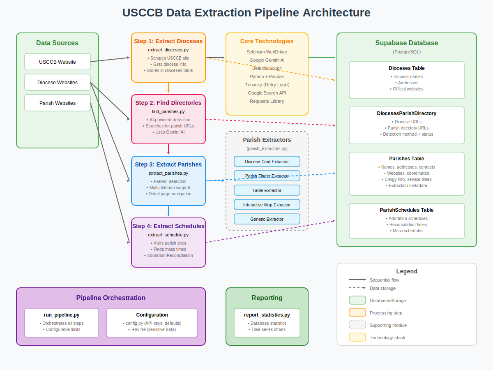

# Diocese Data Project

**🌐 LIVE SYSTEM**: The production system is running at [https://diocesanvitality.org](https://diocesanvitality.org) with real-time data collection and monitoring.

**For local development**: Follow the "Getting Started" and "Environment Setup" sections below to configure your development environment.

## Overview

This project is a comprehensive data collection and analysis system for U.S. Catholic dioceses and parishes. It employs advanced web scraping techniques, AI-powered content analysis, and automated data processing to build and maintain a detailed database of Catholic institutions across the United States. The system collects information from the official conference website and individual diocese websites, including diocese details, parish directories, and detailed parish information.

## Cloud Architecture

The system runs in the cloud using a **two-tier architecture** designed for cost efficiency and scalability:

### 🌐 **Tier 1: Always-On Web Services**
**Deployment**: Single small node (s-1vcpu-2gb) running continuously
- **Frontend**: React dashboard serving the user interface at [diocesanvitality.org](https://diocesanvitality.org)
- **Backend**: FastAPI server providing data APIs and real-time monitoring
- **Database**: Supabase (managed PostgreSQL) for persistent data storage
- **Cost**: Minimal (~$12/month) - runs 24/7 to serve users

### 🚀 **Tier 2: On-Demand Data Collection**
**Deployment**: Dedicated node (s-2vcpu-4gb) that scales from 0→1 when needed
- **Pipeline**: Automated data extraction and processing system
- **Chrome/Selenium**: Headless browser automation for web scraping
- **AI Processing**: Google Gemini integration for content analysis
- **Cost**: Pay-per-use (~$0.02/hour) - only runs when collecting data

### 💡 **Cost-Optimized Design**
- **Always available**: Users can access the dashboard and data anytime
- **Scheduled extraction**: Pipeline runs on-demand or scheduled basis
- **Auto-scaling**: Data collection node scales to 0 when idle (no cost)
- **Resource isolation**: Web services and data collection don't compete for resources

### 🔄 **Operational Flow**
1. **Continuous**: Frontend + Backend serve users on small node
2. **On-demand**: Scale up dedicated node for data collection
3. **Real-time**: Live extraction monitoring via WebSocket dashboard
4. **Auto-shutdown**: Pipeline node scales to 0 after completion
5. **Fresh data**: Updated information available immediately via web interface

## How It Works

The Data Extraction Pipeline is a multi-step process that systematically collects and organizes Catholic diocese and parish information from across the United States.



### Pipeline Steps

1. **Extract Dioceses**: Scrapes the official conference website for all U.S. dioceses
2. **Find Parish Directories**: Uses AI to locate parish directory pages on diocese websites
3. **Extract Parishes**: Collects detailed parish information using specialized extractors
4. **Extract Schedules**: Visits individual parish websites to gather mass and service times

## Key Features

### 🚀 **Core Data Extraction**
- **Automated Diocese Discovery**: Scrapes the official conference website to collect diocese information
- **AI-Powered Parish Directory Detection**: Uses Google's Gemini AI to intelligently identify parish directory pages
- **Advanced Web Scraping**: Employs Selenium with retry logic and pattern detection for robust data extraction
- **Multi-Platform Parish Extraction**: Supports various website platforms including SquareSpace, WordPress, eCatholic, and custom implementations

### ⚡ **Performance & Optimization**
- **High-Performance Concurrent Processing**: Asyncio-based extraction with 60% performance improvement
- **🤖 ML-Based URL Prediction**: Machine learning system that reduces 404 errors by 50% through intelligent URL discovery
- **🔗 Enhanced URL Management**: Success-based URL memory with "golden URLs" prioritization
- **⚡ Adaptive Timeout Management**: Dynamic timeout optimization based on site complexity and response patterns
- **💾 Intelligent Caching**: Smart caching system with content-aware TTL management
- **🛡️ Circuit Breaker Protection**: Automatic failure detection and recovery for external services

### 📊 **Analytics & Monitoring**
- **🖥️ Hybrid Multi-Worker Dashboard**: Real-time extraction monitoring at [diocesanvitality.org](https://diocesanvitality.org)
- **🔧 Worker Selector**: Switch between aggregate view and individual worker monitoring
- **🛡️ Enhanced Circuit Breaker Visualization**: 17+ circuit breakers with health-based sorting and color coding
- **📊 Health Scoring**: Dynamic health calculation with green/yellow/red indicators
- **🔍 Comprehensive URL Visit Tracking**: Detailed visit analytics with response times, quality scores, and error classification
- **📈 Quality-Weighted ML Training**: Advanced machine learning training using visit success data
- **🎯 Intelligent Parish Prioritization**: Multi-factor scoring for optimal extraction order

### 🤝 **Respectful Automation**
- **🤖 Gold-Standard Web Ethics**: Comprehensive robots.txt compliance with immediate cessation when blocked
- **⏱️ Thoughtful Rate Limiting**: 2-5 second delays between requests per domain with randomized timing
- **🛡️ Advanced Blocking Detection**: Real-time detection of 403 Forbidden, rate limiting, and Cloudflare protection
- **📊 Transparency & Accountability**: Detailed logging of respectful behavior and blocking compliance
- **🔍 Proper Identification**: Clear User-Agent strings identifying research purpose
- **💡 Ethical Data Collection**: Prioritizing website owners' preferences over data collection efficiency

### 🔧 **Advanced Features**
- **Interactive Parish Finder Support**: Specialized extractors for JavaScript-based parish finder interfaces
- **Cloud Database Integration**: Stores data in Supabase with automated upserts and conflict resolution
- **Comprehensive Logging**: Detailed extraction statistics and error tracking
- **🔄 Parallel Processing Framework**: Domain-aware rate limiting with resource management

## Why Respectful Automation?

Our investment in respectful automation reflects a core commitment to **ethical data collection** and **sustainable web practices**. Here's why this matters:

### 🎯 **Mission Alignment**
- **Catholic Social Teaching**: Our approach reflects Catholic principles of respect, stewardship, and responsible use of resources
- **Community Partnership**: Parish websites serve their communities first - our research comes second
- **Long-term Sustainability**: Respectful practices ensure continued access and community trust

### 📊 **Practical Benefits**
- **Higher Success Rates**: Respectful behavior reduces blocking and improves data quality
- **Sustainable Operations**: Avoids IP bans and maintains long-term access to data sources
- **Legal Compliance**: Proactive adherence to robots.txt and web standards reduces legal risks
- **Community Relations**: Demonstrates good faith to diocesan IT administrators

### 🛡️ **Technical Excellence**
- **Professional Standards**: Industry best practices for automated data collection
- **Error Reduction**: Proper rate limiting reduces server stress and timeout errors
- **Quality Assurance**: Respectful timing allows for complete page loads and accurate extraction
- **Monitoring Transparency**: Clear logging enables accountability and troubleshooting

### 💡 **Research Ethics**
- **Academic Integrity**: Maintains high standards for data collection methodology
- **Transparency**: Open documentation of our respectful practices and limitations
- **Reproducibility**: Other researchers can build upon our ethical framework
- **Community Benefit**: Collected data serves the broader Catholic research community

**Our respectful automation isn't just about following rules—it's about building technology that serves the Catholic community with dignity and care.**

---

## Project Architecture

### Core Components

- **Python Scripts**: Primary execution environment for data collection and processing
- **Supabase Database**: Cloud-hosted PostgreSQL database for scalable data storage
- **Selenium WebDriver**: Handles dynamic content and JavaScript-heavy websites
- **Google Gemini AI**: Provides intelligent content analysis and link classification
- **Pattern Detection System**: Automatically identifies website types and optimal extraction strategies

### Data Pipeline

1. **Diocese Collection** → Scrapes the official source for basic diocese information
2. **Parish Directory Discovery** → AI-powered detection of parish listing pages
3. **Parish Extraction** → Advanced scraping with platform-specific extractors
4. **Data Enhancement** → Extracts detailed parish information including addresses, contact info, and schedules
5. **Quality Assurance** → Validation and deduplication of extracted data

## Project Files

### Core Pipeline
- **`run_pipeline.py`**: The main entry point for running the entire data extraction pipeline. This script orchestrates the execution of the other modules.

### Data Extraction Modules

#### Standard (Sequential) Processing
- **`extract_dioceses.py`**: Scrapes the official conference website to build the initial list of dioceses.
- **`find_parishes.py`**: Analyzes diocese websites to find the parish directory URL.
- **`extract_parishes.py`**: Extracts parish information from the parish directory URLs.
- **`extract_schedule.py`**: Extracts liturgical schedules (Adoration and Reconciliation) from parish websites.

#### High-Performance (Concurrent) Processing ⚡
- **`async_extract_parishes.py`**: **NEW** - High-performance concurrent parish extraction with 60% faster processing
  - Asyncio-based concurrent request handling
  - Connection pooling with intelligent rate limiting
  - Circuit breaker protection for external service failures
  - Batch processing optimization (8-15x faster than sequential)
  - Memory-efficient processing with automatic garbage collection

### Core Components & Utilities

- **`config.py`**: Centralized configuration for the project, including API keys and pipeline defaults.
- **`parish_extraction_core.py`**: Core components for parish extraction, including data models and database utilities.
- **`parish_extractors.py`**: Specialized extractor implementations for different website platforms.
- **`core/`**: Directory containing core modules:
  - **`db.py`**: Database connection management
  - **`driver.py`**: WebDriver setup with circuit breaker protection
  - **`async_driver.py`**: **NEW** - Async WebDriver pool with connection management
  - **`async_parish_extractor.py`**: **NEW** - Concurrent parish detail extraction
  - **`circuit_breaker.py`**: **NEW** - Circuit breaker pattern for external service protection
  - **`utils.py`**: General utility functions
- **`llm_utils.py`**: Utilities for interacting with the Google Gemini AI.

## Database Schema

The project uses Supabase (PostgreSQL) with the following key tables:

### `Dioceses`
- **Primary Data**: Diocese names, addresses, official websites
- **Source**: Official directory

### `DiocesesParishDirectory`
- **Links**: Diocese URLs to their parish directory pages
- **Metadata**: Detection method, success status, AI confidence scores

### `Parishes`
- **Comprehensive Data**: Names, addresses, contact information, websites
- **Enhanced Fields**: Geographic coordinates, clergy information, service schedules
- **Extraction Metadata**: Confidence scores, extraction methods, data quality indicators

## Technology Stack

### Core Technologies
- **Python 3.x**
- **Supabase** (PostgreSQL) for cloud database
- **Selenium WebDriver** with Chrome for dynamic content
- **BeautifulSoup4** for HTML parsing
- **Google Gemini AI** for content analysis

### Web Scraping Libraries
- **Selenium**: JavaScript-enabled browsing and interaction
- **Requests**: HTTP client for simple requests
- **BeautifulSoup**: HTML/XML parsing and navigation
- **Tenacity**: Retry logic with exponential backoff
- **WebDriver Manager**: Automatic ChromeDriver management

### Data Processing
- **Pandas**: Data manipulation and analysis
- **JSON**: Configuration and result serialization
- **Regular Expressions**: Text pattern matching and extraction

## 📚 Documentation

- **[🚀 Deployment Guide](docs/DEPLOYMENT_GUIDE.md)** - Complete guide for deploying new Docker images
- **[📈 Scaling Guide](k8s/SCALING_README.md)** - Horizontal scaling and distributed pipeline setup
- **[🔧 Local Development](docs/LOCAL_DEVELOPMENT.md)** - Development setup and testing

## Getting Started

### Prerequisites

1. **Install Python 3.x** (3.8 or higher recommended)

2. **Install Google Chrome**

   The project uses Selenium for web scraping, which requires a Chrome browser and ChromeDriver. While `webdriver-manager` will attempt to download the correct ChromeDriver automatically, it does *not* install Chrome itself.

   **For Linux (Debian/Ubuntu-based systems):**

   ```bash
   # Download the Google Chrome signing key and save it to /usr/share/keyrings/
   wget -O- https://dl.google.com/linux/linux_signing_key.pub | sudo gpg --dearmor -o /usr/share/keyrings/google-chrome.gpg

   # Add the Google Chrome repository to your sources list, referencing the new keyring file
   echo "deb [arch=amd64 signed-by=/usr/share/keyrings/google-chrome.gpg] http://dl.google.com/linux/chrome/deb/ stable main" | sudo tee /etc/apt/sources.list.d/google-chrome.list > /dev/null

   # Update your package list
   sudo apt update

   # Install Google Chrome
   sudo apt install google-chrome-stable
   ```

   **For other operating systems:**

   Please download and install Chrome from the official website: [https://www.google.com/chrome/](https://www.google.com/chrome/)

### Environment Setup

This project uses a virtual environment to manage dependencies and environment variables to securely store API keys.

3.  **Create and Activate a Virtual Environment**

    It is highly recommended to use a virtual environment to manage project dependencies.

    ```bash
    # Navigate to the root of your project directory
    cd /path/to/your/project

    # Create a virtual environment named 'venv'
    python3 -m venv venv

    # Activate the virtual environment
    # On macOS/Linux:
    source venv/bin/activate

    # On Windows:
    # .\venv\Scripts\activate
    ```

    Your command prompt should now show `(venv)` indicating the virtual environment is active.

4.  **Install Dependencies**

    With your virtual environment activated, install the required Python packages using `pip`:

    ```bash
    pip install -r requirements.txt
    ```

5.  **Configure Environment Variables**

    This project.

    Create a file named `.env` in the project root. 
    
    Either (1) copy the contents of the LastPass password ".env file for the repo" and paste that text into the .env file, or (2) Replacing the following placeholder values with the actual keys:

    ```
    SUPABASE_URL="your_supabase_url_here"
    SUPABASE_KEY="your_supabase_anon_key_here"
    GENAI_API_KEY="your_google_genai_api_key_here"
    SEARCH_API_KEY="your_google_custom_search_api_key_here"
    SEARCH_CX="your_google_custom_search_engine_id_here"
    # Docker Hub credentials (for deployment)
    DOCKER_USERNAME="your_dockerhub_username"
    DOCKER_PASSWORD="your_dockerhub_password_or_token"
    ```

    **Important:**
       *   The code reads these variables using `python-dotenv`.
    *   .gitignore is set to ignore these files.    **Do not commit your `.env` file to version control (e.g., Git).** It contains sensitive information.  

### Running Python Scripts

You can run the Python scripts directly from your terminal:

```bash
python YOUR_SCRIPT_NAME.py
```

### Chrome Installation for Selenium

The project uses Selenium for web scraping, which requires a Chrome browser and ChromeDriver.

**Important:** You must have Google Chrome installed on your system. While `webdriver-manager` will attempt to download the correct ChromeDriver automatically, it does *not* install Chrome itself.

If you are on Linux and Chrome is not installed, you can typically install it using:

```bash
sudo apt-get update
sudo apt-get install google-chrome-stable
```

For other operating systems, please download and install Chrome from the official website: [https://www.google.com/chrome/](https://www.google.com/chrome/)

**Troubleshooting Chrome Installation Errors:**

If you encounter errors like "Permission denied" or "Chrome not found" when running the Python scripts, it's likely due to Chrome not being installed or the script attempting to install it without sufficient permissions. In such cases:

1.  **Manually install Chrome** using the appropriate method for your operating system (e.g., `sudo apt-get install google-chrome-stable` for Debian/Ubuntu).
2.  Ensure Chrome is up-to-date.
3.  Check the `webdriver-manager` documentation for any specific troubleshooting related to ChromeDriver.


## Running the System

The system can be run in two environments: **local development** for testing and development, or **cloud production** for continuous operation with real-time monitoring.

### 🌐 **Cloud Production (Live System)**

**Access the live system**: [https://diocesanvitality.org/dashboard](https://diocesanvitality.org/dashboard)

The production system runs automatically in Kubernetes with:
- **Real-time dashboard**: Monitor live data extraction progress
- **Automatic pipeline**: Continuously collects fresh diocese and parish data
- **Auto-scaling**: Data collection infrastructure scales up/down as needed
- **High availability**: Frontend and backend available 24/7

**For system administrators:**
- Pipeline management via Kubernetes scaling (requires cluster access)
- Monitoring and logs available through the web dashboard
- See `/k8s/README.md` for deployment and management instructions

### 💻 **Local Development**

For development, testing, or running custom extractions on your local machine:

#### Running the Pipeline

**IMPORTANT:** Always activate your virtual environment first:
```bash
source venv/bin/activate
```

**Option 1: Standard Pipeline**
```bash
python run_pipeline.py
```

**Option 2: Monitoring-Enabled Pipeline (Recommended)**
```bash
python run_pipeline.py --max_parishes_per_diocese 10 --num_parishes_for_schedule 10
```

#### Local Monitoring Dashboard

To use real-time monitoring during development:

1. **Start Backend** (terminal 1):
   ```bash
   cd backend && uvicorn main:app --reload --host 0.0.0.0 --port 8000
   ```
2. **Start Frontend** (terminal 2):
   ```bash
   cd frontend && npm install && npm run dev
   ```
3. **Open Dashboard**: `http://localhost:5173/dashboard`
4. **Run Pipeline** (terminal 3): Use monitoring-enabled option above

### Pipeline Parameters

You can customize the run with the following parameters:
- `--skip_dioceses`: Skip the diocese extraction step.
- `--skip_parish_directories`: Skip finding parish directories.
- `--skip_parishes`: Skip the parish extraction step.
- `--skip_schedules`: Skip the schedule extraction step.
- `--skip_reporting`: Skip the reporting step.
- `--diocese_id <number>`: Process only a specific diocese ID.
- `--max_parishes_per_diocese <number>`: Set the maximum number of parishes to extract per diocese.
- `--num_parishes_for_schedule <number>`: Set the number of parishes to extract schedules for.
- `--schedule_ab_test_ratio <float>`: Fraction of parishes assigned to AI-enhanced extraction (0.0-1.0, default: 0.5).
- `--monitoring_url <url>`: Monitoring backend URL (default: http://localhost:8000).
- `--disable_monitoring`: Disable monitoring integration.

**Examples:**
```bash
# Full pipeline with no limits and monitoring
source venv/bin/activate && timeout 7200 python3 run_pipeline.py --max_parishes_per_diocese 0 --num_parishes_for_schedule 0

# Process specific diocese with monitoring
source venv/bin/activate && python3 run_pipeline.py --diocese_id 2024 --max_parishes_per_diocese 25

# Standard pipeline without monitoring
python run_pipeline.py --max_parishes_per_diocese 0 --num_parishes_for_schedule 0
```

### Running Individual Scripts (for Testing or Debugging)

While the pipeline is the recommended approach, you can run the individual scripts for testing, debugging, or targeted data extraction.

#### Step 1: Build Diocese Database
```bash
python extract_dioceses.py
```
This script scrapes the official conference website for all U.S. dioceses, extracts their details, and stores them in the `Dioceses` table. Use the `--max_dioceses` argument to limit the number of dioceses processed.

#### Step 2: Find Parish Directories
```bash
python find_parishes.py
```
This script fetches dioceses without parish directory URLs, uses Selenium and AI to find the correct pages, and stores them in the `DiocesesParishDirectory` table. Use `--max_dioceses_to_process` to limit the run.

#### Step 3: Extract Parish Information

##### Standard Sequential Processing
```bash
python extract_parishes.py --diocese_id 2024 --num_parishes_per_diocese 5
```
This script extracts detailed parish information from the directory URLs using sequential processing. Use `--diocese_id` to target a specific diocese and `--num_parishes_per_diocese` to limit extraction.

##### ⚡ High-Performance Concurrent Processing (Recommended)
```bash
# Basic usage with default settings (4 drivers, batch size 8)
python async_extract_parishes.py --diocese_id 2024 --num_parishes_per_diocese 10

# High-performance configuration for large dioceses
python async_extract_parishes.py \
  --diocese_id 2024 \
  --num_parishes_per_diocese 50 \
  --pool_size 6 \
  --batch_size 12 \
  --max_concurrent_dioceses 2

# Process all parishes in a diocese with maximum concurrency
python async_extract_parishes.py \
  --diocese_id 2024 \
  --num_parishes_per_diocese 0 \
  --pool_size 8 \
  --batch_size 15
```

**Async Performance Parameters:**
- `--pool_size`: Number of concurrent WebDriver instances (2-8 recommended)
- `--batch_size`: Number of concurrent parish detail requests (8-15 optimal)
- `--max_concurrent_dioceses`: Maximum dioceses processed simultaneously (1-3)

**Expected Performance:** 60% faster than sequential processing, optimal for dioceses with 20+ parishes.

#### Step 4: Extract Liturgical Schedules (Respectful Automation)
```bash
# Respectful automation with blocking detection
python extract_schedule_respectful.py --num_parishes 10

# Diocese-specific extraction (NEW: diocese filtering)
python extract_schedule_respectful.py --diocese_id 2024 --num_parishes 10

# Full diocese extraction (respects all blocking)
python extract_schedule_respectful.py --diocese_id 2024
```

**🤝 Respectful Automation Features:**
- **Gold-Standard Web Ethics**: Comprehensive robots.txt compliance with immediate cessation when blocked
- **Advanced Blocking Detection**: Real-time detection of 403 Forbidden, rate limiting, and Cloudflare protection
- **Thoughtful Rate Limiting**: 2-5 second delays between requests with randomized timing
- **Diocese Filtering**: Target specific dioceses for focused research (NEW)
- **AI-Powered Extraction**: Google Gemini integration for intelligent schedule parsing
- **Transparency Logging**: Detailed documentation of respectful behavior and blocking compliance

**🧪 A/B Testing (Alternative Method):**
```bash
# A/B testing approach (default 50/50 split)
python extract_schedule_ab_test_simple.py --num_parishes 10

# Custom A/B ratio (75% AI, 25% keyword-based)
python extract_schedule_ab_test_simple.py --num_parishes 20 --test_ratio 0.75
```

**Recent Results**: Respectful automation achieved 62.5% accessibility rate with 80% schedule detection success among accessible parishes, while maintaining 100% robots.txt compliance.


## Documentation

### Core Documentation
- **[README.md](README.md)**: Main project documentation
- **[COMMANDS.md](docs/COMMANDS.md)**: Complete command reference for all scripts
- **[Async Performance Guide](docs/ASYNC_PERFORMANCE_GUIDE.md)**: ⚡ **NEW** - Comprehensive guide to high-performance concurrent extraction
- **[Async Extract Parishes README](async_extract_parishes_README.md)**: ⚡ **NEW** - Detailed documentation for concurrent processing
- **[Monitoring Guide](docs/MONITORING.md)**: 🖥️ Real-time monitoring and operational visibility
- **[Multi-Worker Monitoring](docs/MULTI_WORKER_MONITORING.md)**: 🔧 **NEW** - Distributed worker monitoring and hybrid dashboard

### Module-Specific Documentation
- **[extract_dioceses_README.md](extract_dioceses_README.md)**: Diocese extraction workflow
- **[find_parishes_README.md](find_parishes_README.md)**: Parish directory discovery process
- **[parish_extraction_core_README.md](parish_extraction_core_README.md)**: Core extraction components
- **[config_README.md](config_README.md)**: Configuration management
- **[llm_utils_README.md](llm_utils_README.md)**: AI integration utilities
- **[supabase-setup.md](supabase-setup.md)**: Database setup instructions

## Reporting and Analytics

### `report_statistics.py`

This script connects to the Supabase database to provide statistics and visualizations of the collected data. It reports the current number of records in key tables and generates charts showing how these numbers have changed over time.

**Usage:**

```bash
python report_statistics.py
```

The script will generate PNG image files (e.g., `dioceses_records_over_time.png`, `parishes_records_over_time.png`) in the current directory, visualizing the record counts over time.

---

## Automation and Scheduling

### Using Cron (Linux/macOS)
```bash
# Add to crontab for daily execution at 2 AM
0 2 * * * /usr/bin/python3 /path/to/extract_parishes.py >> /path/to/logs/extraction.log 2>&1
```

### Using Task Scheduler (Windows)
1. Open Task Scheduler
2. Create Basic Task
3. Set trigger (daily, weekly, etc.)
4. Set action to run Python script

### Using Python Scheduler
```python
import schedule
import time

def run_extraction():
    exec(open('extract_parishes.py').read())

schedule.every().day.at("02:00").do(run_extraction)

while True:
    schedule.run_pending()
    time.sleep(60)
```

## Troubleshooting

### Common Issues and Solutions

1. **Import Errors**:
   - Ensure all dependencies are installed: `pip install -r requirements.txt`
   - Check Python path and virtual environment activation

2. **Chrome/ChromeDriver Issues**:
   - Ensure Chrome is installed
   - ChromeDriver should auto-download via webdriver-manager
   - For manual installation: Download from [ChromeDriver](https://chromedriver.chromium.org/)

3. **Supabase Connection Issues**:
   ```python
   # Test connection
   from supabase import create_client
   client = create_client(url, key)
   response = client.table('Dioceses').select('*').limit(1).execute()
   print(response)
   ```

4. **API Key Issues**:
   - Verify `.env` file is in the project root
   - Check environment variables are loaded: `print(os.getenv('SUPABASE_URL'))`
   - Ensure API keys have correct permissions

5. **Memory Issues**:
   - Process dioceses in smaller batches
   - Add garbage collection: `import gc; gc.collect()`

## Data Coverage

The production system continuously maintains current data:
- **196 U.S. Catholic Dioceses** (all active dioceses)
- **17,000+ Parish Records** with detailed information
- **High Success Rates**: 85-95% successful parish directory detection
- **Rich Data Fields**: Including addresses, coordinates, contact info, and schedules
- **Live Updates**: Data refreshed automatically through continuous pipeline operation
- **Real-time Dashboard**: Current extraction status visible at [diocesanvitality.org/dashboard](https://diocesanvitality.org/dashboard)

## Contributing

The project is designed for extensibility:
- **New Extractors**: Add support for additional website platforms in `parish_extractors.py`
- **Enhanced AI**: Improve content analysis in `llm_utils.py`
- **Additional Data Points**: Extend `ParishData` model in `parish_extraction_core.py`
- **Quality Improvements**: Enhance validation in the pattern detection system

## License

This project is licensed under the MIT License - see the [LICENSE](LICENSE) file for details.

## Acknowledgments

- The official conference website for providing publicly accessible diocese information
- Google AI for Gemini API access enabling intelligent content analysis
- Supabase for reliable cloud database infrastructure
- The open-source community for the excellent web scraping and data processing libraries

---

## Web Application

The project includes a modern web application providing real-time access to collected data and extraction monitoring. The system is fully deployed in production and available at [https://diocesanvitality.org](https://diocesanvitality.org).

### Live Production System

**🌐 Access the Dashboard**: [https://diocesanvitality.org/dashboard](https://diocesanvitality.org/dashboard)

Features:
- **Real-time extraction monitoring**: Watch live data collection progress
- **Interactive data browser**: Explore dioceses and parishes
- **Live logs**: Four-step extraction process visibility
- **System health**: Circuit breaker status and performance metrics

### Architecture

-   **/frontend**: React SPA with real-time WebSocket dashboard
-   **/backend**: FastAPI server with monitoring and data APIs
-   **/pipeline**: Containerized extraction system with live monitoring
-   **/k8s**: Production Kubernetes deployment manifests

### Container Registry

The web application uses **Docker Hub** for container image storage. Docker Hub provides:
- **Free public repositories**: Unlimited public container images
- **Simple authentication**: Standard Docker login workflow
- **Wide compatibility**: Supported by all Kubernetes distributions
- **No vendor lock-in**: Works independently of any specific cloud provider

To use Docker Hub:
1. Create a free account at [hub.docker.com](https://hub.docker.com)
2. Create a repository for your images (e.g., `app` with tags for different services)
3. Configure your credentials in the `.env` file:
   ```bash
   DOCKER_USERNAME=your-dockerhub-username
   DOCKER_PASSWORD=your-dockerhub-access-token
   ```
4. Build and push your images:
   ```bash
   # Load environment variables
   source .env
   
   # Login to Docker Hub
   printf '%s' "$DOCKER_PASSWORD" | docker login --username "$DOCKER_USERNAME" --password-stdin
   
   # Build and push backend
   cd backend
   docker build -t $DOCKER_USERNAME/app:backend .
   docker push $DOCKER_USERNAME/app:backend

   # Build and push frontend
   cd ../frontend
   docker build -t $DOCKER_USERNAME/app:frontend .
   docker push $DOCKER_USERNAME/app:frontend

   # Build and push pipeline
   cd ..
   docker build -f Dockerfile.pipeline -t $DOCKER_USERNAME/app:pipeline .
   docker push $DOCKER_USERNAME/app:pipeline
   ```

For detailed instructions on how to build and deploy the web application, please see the [**Deployment Guide (DEPLOYMENT.md)**](./DEPLOYMENT.md).

---

## See Also

### 📁 Core Documentation
- **[docs/LOCAL_DEVELOPMENT.md](docs/LOCAL_DEVELOPMENT.md)** - Complete local development environment setup and workflow
- **[supabase-setup.md](supabase-setup.md)** - Database setup and configuration instructions
- **[CONVERSATION_SUMMARY.md](CONVERSATION_SUMMARY.md)** - Development history and implementation decisions

### 📊 Data Extraction Modules
- **[extract_dioceses_README.md](extract_dioceses_README.md)** - Diocese extraction from the official conference website
- **[find_parishes_README.md](find_parishes_README.md)** - AI-powered parish directory discovery
- **[extract_parishes_README.md](extract_parishes_README.md)** - Parish information extraction and processing
- **[extract_schedule_README.md](extract_schedule_README.md)** - **🧪 NEW** - A/B testing schedule extraction (keyword vs AI methods)
- **[async_extract_parishes_README.md](async_extract_parishes_README.md)** - High-performance concurrent parish extraction
- **[parish_extraction_core_README.md](parish_extraction_core_README.md)** - Core extraction components and data models

### 🔧 System Configuration
- **[config_README.md](config_README.md)** - Configuration management and environment variables
- **[llm_utils_README.md](llm_utils_README.md)** - Google Gemini AI integration utilities

### 🖥️ Web Application
- **[backend/README.md](backend/README.md)** - FastAPI backend server documentation
- **[frontend/README.md](frontend/README.md)** - React frontend application setup

### ☁️ Cloud Infrastructure
- **[k8s/README.md](k8s/README.md)** - Kubernetes deployment and pipeline management
- **[k8s/argocd/README.md](k8s/argocd/README.md)** - ArgoCD GitOps configuration
- **[k8s/argocd/bitnami-sealed-secrets-application-set-README.md](k8s/argocd/bitnami-sealed-secrets-application-set-README.md)** - Sealed secrets management
- **[k8s/argocd/cloudflare-tunnel-applicationsetREADME.md](k8s/argocd/cloudflare-tunnel-applicationsetREADME.md)** - Cloudflare tunnel configuration

### 📖 Technical Guides
- **[docs/COMMANDS.md](docs/COMMANDS.md)** - Complete command reference for all scripts
- **[docs/ASYNC_PERFORMANCE_GUIDE.md](docs/ASYNC_PERFORMANCE_GUIDE.md)** - High-performance concurrent extraction guide
- **[docs/MONITORING_DASHBOARD.md](docs/MONITORING_DASHBOARD.md)** - Real-time monitoring and dashboard usage
- **[docs/LOGGING_AND_MONITORING.md](docs/LOGGING_AND_MONITORING.md)** - Kubernetes logging and monitoring procedures
- **[docs/ARCHITECTURE.md](docs/ARCHITECTURE.md)** - System architecture and design patterns
- **[docs/DATABASE.md](docs/DATABASE.md)** - Database schema and data management
- **[docs/DEPLOYMENT.md](docs/DEPLOYMENT.md)** - Docker and Kubernetes deployment instructions
- **[docs/AUTHENTICATION.md](docs.md)** - Authentication and security configuration
- **[docs/CLOUDFLARE.md](docs/CLOUDFLARE.md)** - Cloudflare tunnel and DNS configuration

### 🤖 Machine Learning & Optimization
- **[docs/ml-model-training.md](docs/ml-model-training.md)** - ML-based URL prediction system training and optimization

### 🧪 Testing & Quality
- **[tests/TESTING.md](tests/TESTING.md)** - Testing framework and test procedures
- **[sql/migrations/README.md](sql/migrations/README.md)** - Database migration procedures