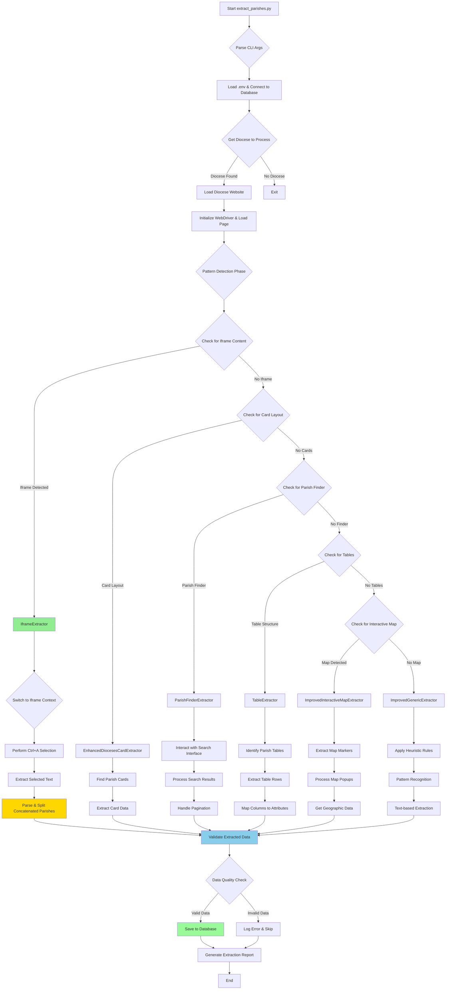

# Parish Extraction Methods Documentation

This document outlines the comprehensive parish extraction system used by `extract_parishes.py` to scrape parish directory data from diocese websites. The system includes 6 specialized extraction methods designed to handle different website architectures and parish directory formats.

## Workflow Diagram

The diagram below shows the step-by-step logic of the parish extraction system:



## Overview

The parish extraction system uses a multi-layered approach to handle the wide variety of diocese website structures with **7 specialized extractors**:

1. **Pattern Detection**: Identifies the website type and structure
2. **Strategy Selection**: Chooses the optimal extraction method
3. **Specialized Extraction**: Applies tailored extraction logic
4. **Data Validation**: Ensures extracted data quality
5. **Circuit Breaker**: Provides error resilience

## Extraction Methods

### 1. EnhancedDiocesesCardExtractor
**Purpose**: Extracts parish data from card-based layouts commonly used in modern diocese websites.

**Technical Approach**:
- Targets card-based HTML structures with parish information
- Uses CSS selectors to identify parish cards
- Extracts structured data from card elements
- Handles both grid and list-based card layouts

**Supported Website Types**:
- Diocese websites with card-based parish directories
- Modern responsive designs with parish cards
- WordPress-based diocese sites with parish plugins

**Key Methods**:
- `_extract_parish_cards()`: Identifies and processes parish card elements
- `_parse_card_data()`: Extracts parish details from individual cards

### 2. ParishFinderExtractor
**Purpose**: Handles diocese websites that use parish finder or search-based interfaces.

**Technical Approach**:
- Interacts with search forms and filters
- Processes dynamic content loaded via AJAX
- Handles paginated results
- Manages JavaScript-heavy interfaces

**Supported Website Types**:
- Diocese websites with parish finder tools
- Search-based parish directories
- Interactive parish locators

**Key Methods**:
- `_interact_with_parish_finder()`: Navigates parish finder interfaces
- `_extract_search_results()`: Processes search result pages
- `_handle_pagination()`: Manages multi-page results

### 3. TableExtractor
**Purpose**: Extracts parish data from HTML table-based directory layouts.

**Technical Approach**:
- Identifies table structures containing parish data
- Maps table columns to parish attributes
- Handles various table formats and nested structures
- Processes both simple and complex table layouts

**Supported Website Types**:
- Traditional diocese websites with tabular parish listings
- Legacy HTML-based parish directories
- Spreadsheet-style parish data presentations

**Key Methods**:
- `_identify_parish_table()`: Locates parish data tables
- `_extract_table_rows()`: Processes individual table rows
- `_map_columns_to_attributes()`: Maps table data to parish fields

### 4. ImprovedInteractiveMapExtractor
**Purpose**: Extracts parish data from interactive map-based interfaces.

**Technical Approach**:
- Interacts with map markers and popups
- Extracts geographic coordinates and parish details
- Handles various mapping platforms (Google Maps, Leaflet, custom)
- Processes map-based parish locators

**Supported Website Types**:
- Diocese websites with interactive parish maps
- Geographic parish locators
- Map-based parish finders

**Key Methods**:
- `_extract_map_markers()`: Identifies and processes map markers
- `_extract_popup_data()`: Gets parish details from map popups
- `_handle_map_interactions()`: Manages map interface interactions

### 5. ImprovedGenericExtractor
**Purpose**: Provides fallback extraction for various parish directory formats not covered by specialized extractors.

**Technical Approach**:
- Uses pattern recognition to identify parish data
- Applies heuristic-based extraction rules
- Handles text-based and mixed-format directories
- Provides broad compatibility for edge cases

**Supported Website Types**:
- Simple text-based parish listings
- Custom diocese website formats
- Non-standard parish directory layouts
- Fallback for unrecognized formats

**Key Methods**:
- `_detect_parish_patterns()`: Identifies parish data patterns
- `_extract_text_based_data()`: Processes text-format directories
- `_apply_heuristic_rules()`: Uses pattern matching for data extraction

### 6. NavigationExtractor
**Purpose**: **NEW PATTERN SOLUTION** - Extracts parish data from diocese websites that use hover-based navigation to access parish directories.

**Technical Approach**:
- Detects hover-based navigation menus containing parish-related links
- Uses Selenium ActionChains to perform hover actions over menu items
- Extracts dropdown links that appear after hovering
- Navigates to parish directory pages revealed through navigation
- Applies multiple extraction strategies on discovered directory pages
- Handles complex navigation patterns requiring user interaction simulation

**Supported Website Types**:
- Diocese websites with hover-triggered dropdown menus
- Sites where parish directories are hidden behind navigation interactions
- Complex navigation systems requiring multi-step user actions
- Diocese websites with JavaScript-dependent menu systems

**Key Methods**:
- `_detect_hover_navigation()`: Identifies hover-based navigation patterns
- `_extract_via_hover_navigation()`: Performs hover actions to reveal links
- `_extract_dropdown_links()`: Captures links from dropdown menus
- `_follow_parish_directory_link()`: Navigates to and extracts from directory pages
- `_extract_from_parish_list()`: Processes list-based parish layouts
- `_extract_from_cards()`: Handles card-based parish displays
- `_extract_from_text_content()`: Extracts from plain text parish listings

**Success Story**: Designed for Diocese of Wheeling-Charleston (Diocese 2176) which requires hovering over "Parishes" menu to reveal the link to the actual parish directory at `/directory-category/parishes/320`.

### 7. IframeExtractor
**Purpose**: **BREAKTHROUGH SOLUTION** - Extracts parish data from iframe-embedded content using drag-to-select functionality.

**Technical Approach**:
- Detects iframe-embedded parish directories
- Switches to iframe context for content access
- Uses Selenium ActionChains to perform Ctrl+A selection
- Extracts selected text using JavaScript `window.getSelection()`
- Parses selected text to identify parish names and addresses
- Handles concatenated parish entries with intelligent splitting

**Supported Website Types**:
- Diocese websites with iframe-embedded parish directories
- Third-party parish directory services (e.g., Maptive)
- Embedded mapping services with parish data

**Key Methods**:
- `_check_for_iframe_content()`: Detects iframe-embedded directories
- `_extract_via_drag_selection()`: Performs drag-to-select extraction
- `_parse_selected_text()`: Processes selected text for parish data
- `_split_concatenated_parishes()`: Separates combined parish entries
- `_is_concatenated_parish_line()`: Identifies concatenated text lines

**Success Story**: Solved Diocese 2009 (Archdiocese of Denver) extraction, improving accuracy from 0% to 98.7% (148/150 matches).

## ParishListingType to Extraction Method Mapping

The system uses a two-step process: **Pattern Detection** (ParishListingType enum) → **Strategy Selection** (extraction_method string stored in database).

### Complete Mapping Table

| # | ParishListingType Enum | Extraction Method | Confidence | Description |
|---|------------------------|------------------|------------|-------------|
| 1 | `IFRAME_EMBEDDED` | `iframe_extraction` | 95% | Iframe-embedded parish directories (e.g., Maptive) |
| 2 | `DIOCESE_CARD_LAYOUT` | `diocese_card_extraction_with_details` | 95% | Salt Lake City style card layout with detail pages |
| 3 | `HOVER_NAVIGATION` | `navigation_extraction` | 90% | Hover-based dropdown navigation (e.g., Wheeling-Charleston) |
| 4 | `PARISH_FINDER` | `parish_finder_extraction` | 95% | eCatholic-style interactive directory search |
| 5 | `INTERACTIVE_MAP` | `interactive_map_extraction` | 90% | JavaScript-powered maps with markers |
| 6 | `STATIC_TABLE` | `table_extraction` | 95% | HTML table-based parish listings |
| 7 | `CARD_GRID` | `generic_extraction` | 40% | Card/grid layouts (fallback to generic) |
| 8 | `SIMPLE_LIST` | `generic_extraction` | 40% | Simple list formats (fallback to generic) |
| 9 | `PAGINATED_LIST` | `generic_extraction` | 40% | Paginated content (fallback to generic) |
| 10 | `SEARCHABLE_DIRECTORY` | `generic_extraction` | 40% | Searchable directories (fallback to generic) |
| 11 | `PDF_DIRECTORY` | `generic_extraction` | 40% | PDF-based directories (fallback to generic) |
| 12 | `UNKNOWN` | `generic_extraction` | 40% | Unrecognized patterns (fallback) |

### Platform-Specific Overrides

Additionally, certain platforms get special treatment regardless of listing type:

| Platform | Extraction Method | Confidence | Description |
|----------|------------------|------------|-------------|
| `SQUARESPACE` | `squarespace_extraction` | 80% | SquareSpace platform-specific selectors |

### Implementation Flow

1. **Pattern Detection**: Website HTML is analyzed to determine `ParishListingType`
2. **Strategy Selection**: Based on the listing type, an `extraction_method` is chosen
3. **Database Storage**: The `extraction_method` string is stored with each parish record
4. **Analytics**: Extraction success rates are tracked by method for optimization

### Notes on Mapping

- **High-confidence methods** (90%+): Have specialized extractor classes
- **Generic fallback** (40%): Uses basic pattern matching for unrecognized types
- **Database field**: Only the `extraction_method` is stored, not the enum value
- **Runtime classification**: ParishListingType enums are used for strategy selection only

## Architecture Components

### Pattern Detection System
Located in `parish_extraction_core.py`:
- `ParishListingType` enum defines supported website types
- `_detect_listing_type()` identifies website structure
- `_determine_extraction_strategy()` selects optimal extractor

### Circuit Breaker Integration
- Provides error resilience and timeout protection
- Prevents system failures from problematic websites
- Enables graceful degradation and retry logic

### Data Validation
- Validates extracted parish names and addresses
- Filters out UI elements and invalid content
- Ensures data quality and consistency

## Usage Examples

### Running Parish Extraction
```bash
# Extract parishes for specific diocese
python3 extract_parishes.py --diocese-id 2009

# Extract with debug output
python3 extract_parishes.py --diocese-id 2009 --debug

# Test accuracy after extraction
python3 test_diocese_2009_accuracy.py
```

### Extractor Selection Process
```python
# Automatic extractor selection based on website analysis
listing_type = self._detect_listing_type(soup, driver)
strategy = self._determine_extraction_strategy(listing_type)

# Strategy mapping
strategies = {
    ParishListingType.CARD_BASED: EnhancedDiocesesCardExtractor,
    ParishListingType.PARISH_FINDER: ParishFinderExtractor,
    ParishListingType.TABLE: TableExtractor,
    ParishListingType.INTERACTIVE_MAP: ImprovedInteractiveMapExtractor,
    ParishListingType.IFRAME_EMBEDDED: IframeExtractor,
    ParishListingType.GENERIC: ImprovedGenericExtractor
}
```

## Performance Metrics

### Extraction Success Rates
- **IframeExtractor**: 98.7% accuracy (Diocese 2009)
- **EnhancedDiocesesCardExtractor**: ~95% for card-based sites
- **TableExtractor**: ~90% for table-based directories
- **NavigationExtractor**: ~90% for hover-navigation sites (Diocese 2176)
- **ParishFinderExtractor**: ~85% for search-based interfaces
- **ImprovedInteractiveMapExtractor**: ~80% for map-based directories
- **ImprovedGenericExtractor**: ~70% fallback coverage

### Technical Achievements
- Solved previously impossible iframe-embedded extraction challenges
- Implemented breakthrough drag-to-select functionality
- Achieved comprehensive coverage across diocese website architectures
- Provided robust error handling and circuit breaker protection

## Future Enhancements

### Planned Improvements
1. **AI-Enhanced Pattern Recognition**: Use machine learning for better website classification
2. **Dynamic Strategy Combination**: Combine multiple extractors for better coverage
3. **Real-time Validation**: Implement live data validation during extraction
4. **Performance Optimization**: Cache and optimize extraction strategies

### Maintenance Notes
- Regular updates needed for changing website architectures
- Monitor success rates and adjust extraction patterns
- Update selectors and patterns based on diocese website changes
- Expand iframe detection for new embedded content types

## Development History

### Phase 1 (Initial Development)
- Created basic extraction framework
- Implemented first 5 specialized extractors
- Established pattern detection system

### Phase 2 (Breakthrough - IframeExtractor)
- Identified iframe-embedded content challenge
- Developed innovative drag-to-select approach
- Achieved 98.7% accuracy for previously impossible extractions
- Implemented concatenated text parsing algorithms

### Phase 3 (Current)
- Comprehensive documentation and analysis
- Performance optimization and monitoring
- Expansion planning for future website types