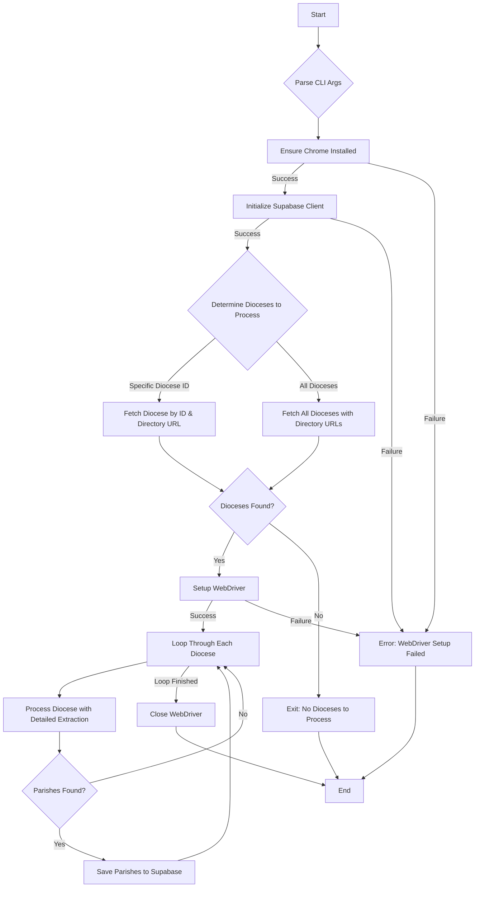

# Workflow for extract_parishes.py

This document outlines the process flow of the `extract_parishes.py` script, which is responsible for extracting parish data from U.S. Catholic dioceses.

The diagram below illustrates the step-by-step logic of the script.

