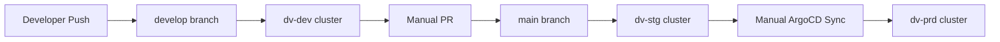

# ArgoCD Applications

This directory contains ArgoCD applications and application sets for GitOps deployment of the Diocesan Vitality system across multiple environments.

## Applications

### Production Application
- **File**: `diocesan-vitality-app.yaml`
- **Target**: Production cluster (`dv-prd`)
- **Namespace**: `diocesan-vitality`
- **Branch**: `main`
- **Sync**: Automatic with prune and self-heal

### Multi-Environment ApplicationSet
- **File**: `diocesan-vitality-environments-applicationset.yaml`
- **Targets**: Development and Staging clusters
- **Environments**:
  - **Development**: `dv-dev` cluster, `develop` branch, `diocesan-vitality-dev` namespace
  - **Staging**: `dv-stg` cluster, `main` branch, `diocesan-vitality-staging` namespace

## Deployment Flow



### GitOps Workflow

1. **Development**:
   ```bash
   git checkout develop
   git add .
   git commit -m "feat: new feature"
   git push origin develop
   ```
   - ArgoCD automatically deploys to `dv-dev` cluster
   - Use development environment for testing

2. **Staging**:
   ```bash
   git checkout main
   git merge develop
   git push origin main
   ```
   - ArgoCD automatically deploys to `dv-stg` cluster
   - Use staging for final testing before production

3. **Production**:
   - Manual sync via ArgoCD UI or CLI
   - Production deployments are manual for safety

## ArgoCD Setup

### Quick Setup (Recommended)

```bash
# Create clusters and setup ArgoCD automatically
cd k8s/cluster-management
./create-dev-stg-clusters.sh  # Choose 'y' for ArgoCD setup

# Or setup ArgoCD in existing clusters
./setup-argocd.sh
```

### Manual Installation

```bash
# Apply the production application
kubectl apply -f k8s/argocd/diocesan-vitality-app.yaml

# Apply the multi-environment ApplicationSet
kubectl apply -f k8s/argocd/diocesan-vitality-environments-applicationset.yaml
```

### Verify Applications

```bash
# List all applications
kubectl get applications -n argocd

# Check ApplicationSet status
kubectl get applicationsets -n argocd

# View application details
kubectl describe application dv-dev-diocesan-vitality -n argocd
kubectl describe application dv-stg-diocesan-vitality -n argocd
```

## Development Workflow with ArgoCD

### Option 1: GitOps Development (Recommended)

```bash
# 1. Create feature branch from develop
git checkout develop
git pull origin develop
git checkout -b feature/my-new-feature

# 2. Develop and test locally
make start-full
make pipeline

# 3. Commit and push to develop branch
git add .
git commit -m "feat: implement new feature"
git checkout develop
git merge feature/my-new-feature
git push origin develop

# 4. ArgoCD automatically deploys to dv-dev
# Monitor deployment in ArgoCD UI or:
kubectl get pods -n diocesan-vitality-dev -w

# 5. Test in dv-dev environment
kubectl port-forward svc/frontend 3000:80 -n diocesan-vitality-dev
# Visit http://localhost:3000

# 6. When ready, promote to staging
git checkout main
git merge develop
git push origin main
# ArgoCD automatically deploys to dv-stg
```

### Option 2: Manual Override (Development Only)

For quick testing during development, you can manually override images:

```bash
# Build and push custom image
docker build -t your-dockerhub-username/diocesan-vitality:dev-$(git rev-parse --short HEAD) .
docker push your-dockerhub-username/diocesan-vitality:dev-$(git rev-parse --short HEAD)

# Temporarily update development deployment
kubectl set image deployment/pipeline pipeline=your-dockerhub-username/diocesan-vitality:dev-$(git rev-parse --short HEAD) -n diocesan-vitality-dev

# Note: ArgoCD will revert this on next sync, so commit your changes to develop branch
```

## Environment Configuration

Each environment uses Kustomize for configuration:

- **Development**: `k8s/environments/development/`
  - Lower resource limits
  - Debug logging enabled
  - Single replica services

- **Staging**: `k8s/environments/staging/`
  - Production-like resources
  - Production logging
  - Multiple replicas

- **Production**: `k8s/` (base configuration)
  - Full production resources
  - Optimized for performance
  - High availability setup

## Accessing Environments

### Development (dv-dev)
```bash
kubectl config use-context dv-dev
kubectl port-forward svc/frontend 3000:80 -n diocesan-vitality-dev
kubectl port-forward svc/backend 8000:8000 -n diocesan-vitality-dev
```

### Staging (dv-stg)
```bash
kubectl config use-context dv-stg
kubectl port-forward svc/frontend 3000:80 -n diocesan-vitality-staging
kubectl port-forward svc/backend 8000:8000 -n diocesan-vitality-staging
```

### Production (dv-prd)
```bash
kubectl config use-context dv-prd
kubectl port-forward svc/frontend 3000:80 -n diocesan-vitality
kubectl port-forward svc/backend 8000:8000 -n diocesan-vitality
```

## ArgoCD Management

### Sync Applications Manually

```bash
# Sync development environment
argocd app sync dv-dev-diocesan-vitality

# Sync staging environment
argocd app sync dv-stg-diocesan-vitality

# Sync production (when ready)
argocd app sync diocesan-vitality-app
```

### View Application Status

```bash
# List all applications
argocd app list

# Get detailed status
argocd app get dv-dev-diocesan-vitality
argocd app get dv-stg-diocesan-vitality

# View logs
argocd app logs dv-dev-diocesan-vitality
```

### Reset Environment

```bash
# Hard refresh (re-sync everything)
argocd app sync dv-dev-diocesan-vitality --prune --force

# Delete and recreate application
argocd app delete dv-dev-diocesan-vitality
kubectl apply -f k8s/argocd/diocesan-vitality-environments-applicationset.yaml
```

## Monitoring Deployments

### Watch Deployments
```bash
# Watch all pods in development
kubectl get pods -n diocesan-vitality-dev -w

# Watch specific deployment
kubectl rollout status deployment/pipeline -n diocesan-vitality-dev

# View deployment events
kubectl get events -n diocesan-vitality-dev --sort-by='.lastTimestamp'
```

### Check Application Health
```bash
# ArgoCD application health
kubectl get applications -n argocd -o wide

# Pod health in each environment
kubectl get pods -n diocesan-vitality-dev
kubectl get pods -n diocesan-vitality-staging
kubectl get pods -n diocesan-vitality
```

## Troubleshooting

### Application Not Syncing
```bash
# Check application status
kubectl describe application dv-dev-diocesan-vitality -n argocd

# Force refresh
argocd app sync dv-dev-diocesan-vitality --force

# Check ArgoCD controller logs
kubectl logs -f deployment/argocd-application-controller -n argocd
```

### Branch/Path Issues
```bash
# Verify repository access
argocd repo list

# Test repository connection
argocd repo get https://github.com/tomknightatl/diocesan-vitality

# Check if path exists
git ls-tree develop:k8s/environments/development
```

### Environment-Specific Issues
```bash
# Check Kustomize build locally
kustomize build k8s/environments/development
kustomize build k8s/environments/staging

# Validate manifests
kubectl apply --dry-run=client -k k8s/environments/development
```

## Security Considerations

- **Repository Access**: ArgoCD needs read access to the GitHub repository
- **Cluster Access**: Each ApplicationSet target requires appropriate cluster permissions
- **Secrets Management**: Use Kubernetes secrets or sealed-secrets for sensitive data
- **RBAC**: Configure appropriate RBAC for ArgoCD service accounts

## Additional Resources

- **Infrastructure Apps**: Other ArgoCD applications in this directory
  - `bitnami-sealed-secrets-application-set.yaml` - Sealed secrets management
  - `cloudflare-tunnel-applicationset.yaml` - Cloudflare tunnel setup
  - `metrics-server-application-set.yaml` - Metrics collection

- **Documentation**:
  - [DEVELOPMENT_ENVIRONMENTS.md](../../docs/DEVELOPMENT_ENVIRONMENTS.md) - Development workflows
  - [CI_CD_PIPELINE.md](../../docs/CI_CD_PIPELINE.md) - CI/CD pipeline details
