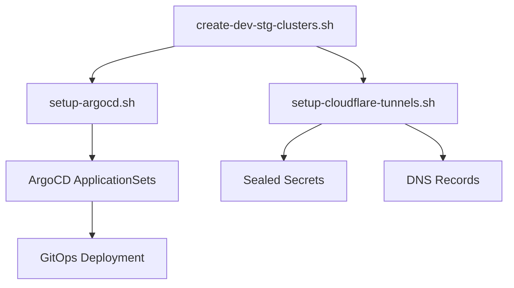

# Cluster Management Scripts

This directory contains scripts for managing development and staging Kubernetes clusters with complete GitOps infrastructure.

## 📁 Scripts Overview

| Script | Purpose | Dependencies |
|--------|---------|--------------|
| `create-dev-stg-clusters.sh` | **Main orchestrator** - Creates clusters, ArgoCD, and tunnels | doctl, kubectl |
| `setup-argocd.sh` | Installs ArgoCD with ApplicationSets | kubectl |
| `setup-cloudflare-tunnels.sh` | Creates Cloudflare tunnels and sealed secrets | cloudflared, kubeseal |
| `destroy-dev-stg-clusters.sh` | Destroys development and staging clusters | doctl, kubectl |

## 🚀 Quick Start

### Prerequisites
```bash
# Install required CLI tools
# doctl (DigitalOcean)
curl -sL https://github.com/digitalocean/doctl/releases/download/v1.115.0/doctl-1.115.0-linux-amd64.tar.gz | tar xz
sudo mv doctl /usr/local/bin/

# kubectl (Kubernetes)
curl -LO "https://dl.k8s.io/release/$(curl -L -s https://dl.k8s.io/release/stable.txt)/bin/linux/amd64/kubectl"
sudo install kubectl /usr/local/bin/

# cloudflared (Cloudflare)
wget https://github.com/cloudflare/cloudflared/releases/latest/download/cloudflared-linux-amd64.deb
sudo dpkg -i cloudflared-linux-amd64.deb

# kubeseal (Sealed Secrets) - Optional but recommended
wget https://github.com/bitnami-labs/sealed-secrets/releases/download/v0.27.1/kubeseal-0.27.1-linux-amd64.tar.gz
tar xz kubeseal && sudo mv kubeseal /usr/local/bin/
```

### Authentication Setup
```bash
# 1. Authenticate with DigitalOcean
doctl auth init

# 2. Authenticate with Cloudflare
cloudflared tunnel login  # Opens browser for auth
```

### Complete Infrastructure Setup
```bash
cd k8s/cluster-management

# Create everything in one go
./create-dev-stg-clusters.sh
# Follow prompts to create:
# - dv-dev and dv-stg clusters  
# - ArgoCD with ApplicationSets
# - Cloudflare tunnels with DNS
```

## 🏗️ What Gets Created

### Kubernetes Clusters
- **dv-dev**: Development cluster
  - 1x slow-pool node (s-1vcpu-2gb)
  - 0x fast-pool nodes (s-2vcpu-4gb, scaled to 0)
  - Namespace: `diocesan-vitality-dev`

- **dv-stg**: Staging cluster  
  - 1x slow-pool node (s-1vcpu-2gb)
  - 0x fast-pool nodes (s-2vcpu-4gb, scaled to 0)
  - Namespace: `diocesan-vitality-staging`

### ArgoCD Applications
- **Diocesan Vitality**: Main application deployment
  - Dev: `develop` branch → `dv-dev` cluster
  - Staging: `main` branch → `dv-stg` cluster

- **Sealed Secrets**: Secure credential management
  - Deployed to all clusters (`kube-system` namespace)
  - Environment-specific resource limits

- **Cloudflare Tunnel**: Secure ingress
  - Environment-specific namespaces and subdomains
  - Automatic DNS record creation

### DNS & Access
- **Development**: 
  - UI: `https://dev.ui.diocesan-vitality.org`
  - API: `https://dev.api.diocesan-vitality.org`
  - ArgoCD: `https://dev.argocd.diocesan-vitality.org`

- **Staging**:
  - UI: `https://stg.ui.diocesan-vitality.org`
  - API: `https://stg.api.diocesan-vitality.org`
  - ArgoCD: `https://stg.argocd.diocesan-vitality.org`

- **Production**:
  - UI: `https://ui.diocesan-vitality.org`
  - API: `https://api.diocesan-vitality.org`
  - ArgoCD: `https://argocd.diocesan-vitality.org`

## 📋 Individual Script Usage

### 1. Cluster Creation Only
```bash
./create-dev-stg-clusters.sh
# Choose 'y' for clusters, 'n' for ArgoCD when prompted
```

### 2. ArgoCD Setup Only
```bash
# For existing clusters
./setup-argocd.sh
```

**What ArgoCD setup installs:**
- ArgoCD server and controllers
- Repository connection to GitHub
- ApplicationSets for:
  - Diocesan Vitality applications
  - Sealed Secrets infrastructure
  - Cloudflare Tunnel infrastructure

### 3. Cloudflare Tunnels Only
```bash
# Requires: cloudflared tunnel login (first time)
./setup-cloudflare-tunnels.sh
```

**What tunnel setup creates:**
- `do-nyc2-dv-dev` tunnel for development
- `do-nyc2-dv-stg` tunnel for staging
- DNS records for each environment
- Sealed secrets with tunnel credentials

### 4. Cluster Destruction
```bash
./destroy-dev-stg-clusters.sh
# Type 'DELETE ALL' when prompted
```

## 🔧 Troubleshooting

### Common Issues

**1. doctl not authenticated:**
```bash
doctl auth init
# Follow browser authentication flow
```

**2. kubectl context not found:**
```bash
doctl kubernetes cluster kubeconfig save dv-dev
doctl kubernetes cluster kubeconfig save dv-stg
```

**3. Cloudflare authentication failed:**
```bash
cloudflared tunnel login
# Select your domain in the browser
```

**4. Sealed secrets not working:**
```bash
# Install kubeseal CLI
kubectl get pods -n kube-system | grep sealed-secrets
# Verify sealed-secrets controller is running
```

**5. ArgoCD applications not syncing:**
```bash
# Check application status
kubectl get applications -n argocd

# Force sync
argocd app sync dv-dev-diocesan-vitality
```

### Cluster Access
```bash
# Switch between clusters
kubectl config use-context dv-dev
kubectl config use-context dv-stg
kubectl config use-context dv-prd

# List all contexts
kubectl config get-contexts
```

### ArgoCD Access

**Via Cloudflare Tunnel (Recommended):**
```bash
# Access ArgoCD directly through secure tunnel
# Dev: https://dev.argocd.diocesan-vitality.org
# Staging: https://stg.argocd.diocesan-vitality.org
# Production: https://argocd.diocesan-vitality.org

# Get admin password for any environment
kubectl config use-context dv-dev  # or dv-stg, dv-prd
kubectl -n argocd get secret argocd-initial-admin-secret -o jsonpath="{.data.password}" | base64 -d
```

**Via Port Forward (Local Development):**
```bash
# Port forward to ArgoCD UI
kubectl port-forward svc/argocd-server -n argocd 8080:443

# Visit: https://localhost:8080
# Login: admin / <password>
```

## 🔐 Security Considerations

### Secrets Management
- **Tunnel credentials**: Stored as sealed secrets in clusters
- **Regular secrets**: Never commit to git
- **Sealed secrets**: Safe to commit to git

### Access Control
- **Cluster access**: Requires DigitalOcean authentication
- **ArgoCD access**: Admin credentials generated per cluster
- **DNS management**: Requires Cloudflare authentication

### Best Practices
1. **Authenticate once**: CLI tools remember credentials
2. **Use sealed secrets**: For production credential management
3. **Monitor resources**: Check cluster resource usage regularly
4. **Backup credentials**: Store ArgoCD admin passwords securely

## 📚 Integration with Development Workflow

### GitOps Deployment
```bash
# Deploy to development
git checkout develop
git add .
git commit -m "feat: new feature"
git push origin develop
# ArgoCD automatically deploys to dv-dev

# Deploy to staging  
git checkout main
git merge develop
git push origin main
# ArgoCD automatically deploys to dv-stg
```

### Manual Operations
```bash
# Scale cluster nodes
doctl kubernetes cluster node-pool resize dv-dev slow-pool --count 2

# Restart ArgoCD sync
argocd app sync dv-dev-diocesan-vitality

# View tunnel status
cloudflared tunnel list
```

## 🔗 Related Documentation

- **[Development Environments](../../docs/DEVELOPMENT_ENVIRONMENTS.md)** - Complete development workflow
- **[ArgoCD Setup](../argocd/README.md)** - ArgoCD configuration details
- **[Infrastructure](../infrastructure/)** - Cloudflare tunnel and sealed secrets configs
- **[CI/CD Pipeline](../../docs/CI_CD_PIPELINE.md)** - Automated deployment workflows

---

## Script Dependencies



**Prerequisites**: doctl, kubectl, cloudflared, kubeseal (optional)
**Order**: Clusters → ArgoCD → Cloudflare Tunnels
**Result**: Complete GitOps infrastructure ready for development